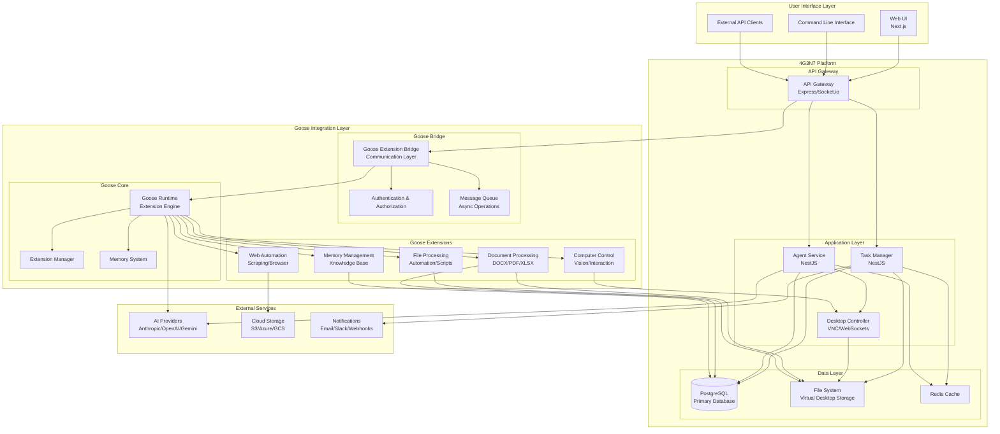
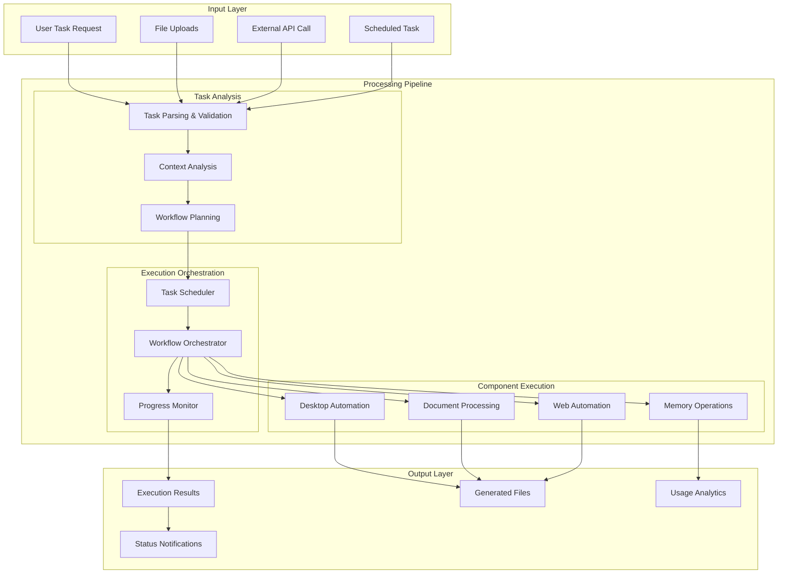
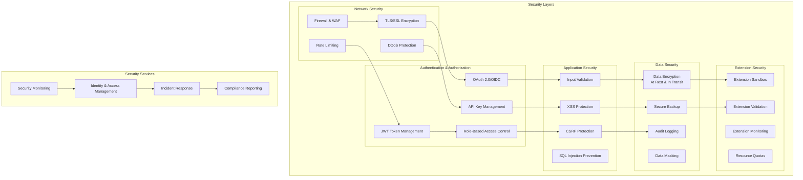
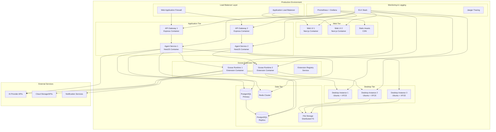
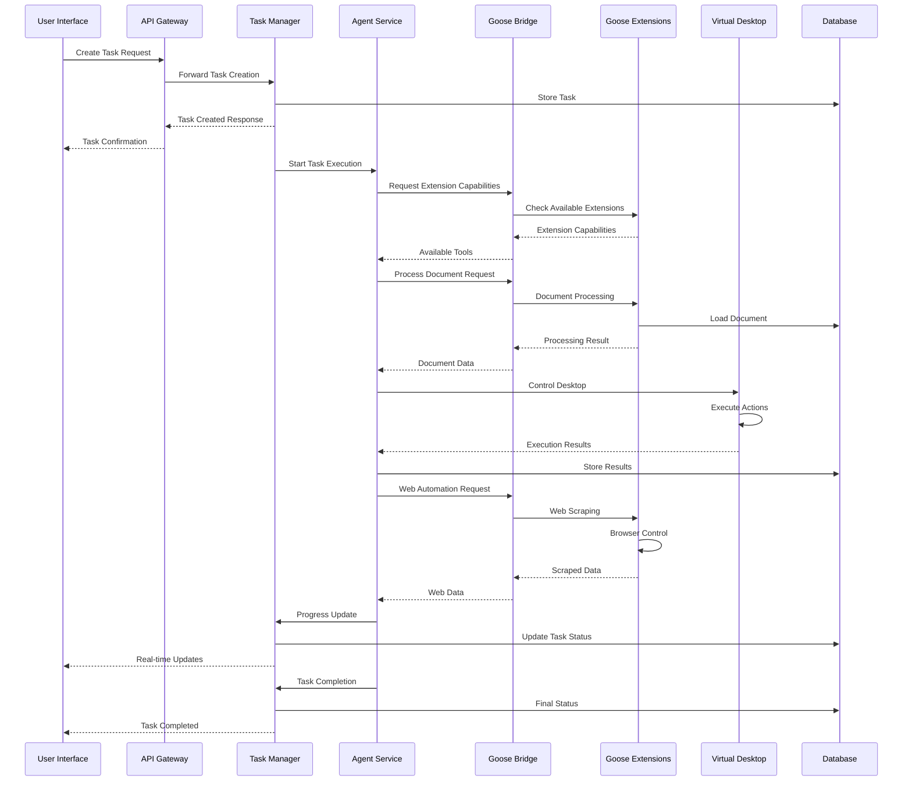
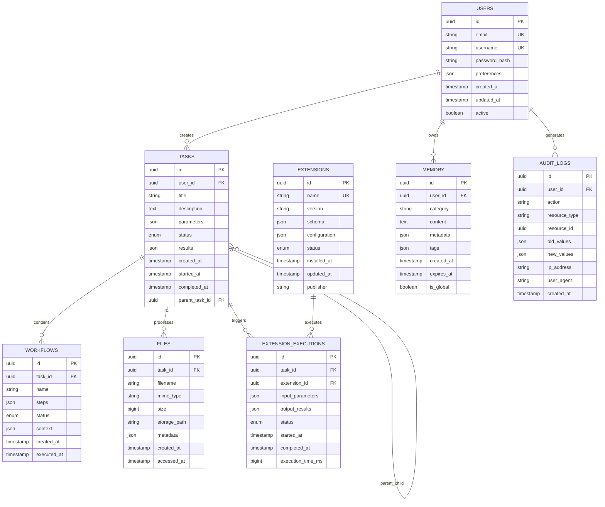
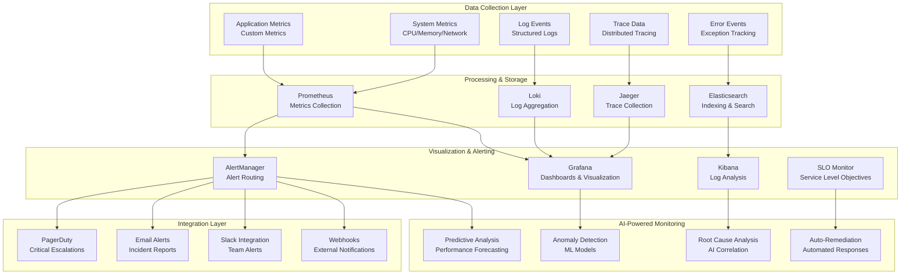

# Goose + 4G3N7 Integration Architecture Diagrams

## 1. High-Level System Architecture

## 2. Data Flow Architecture

## 3. Extension Architecture

```mermaid
graph TB
    subgraph "Extension Management"
        REGISTRY[Extension Registry]
        LOADER[Extension Loader]
        CONFIG[Configuration Manager]
        LIFECYCLE[Lifecycle Manager]
    end

    subgraph "Core Extension Interfaces"
        BASE[Base Extension Interface]
        AUTH_IF[Authentication Interface]
        STORAGE_IF[Storage Interface]
        AI_IF[AI Provider Interface]
        UI_IF[UI Integration Interface]
    end

    subgraph "Document Processing Extensions"
        DOCX_EXT[DOCX Processor<br/>Text extraction & manipulation]
        PDF_EXT[PDF Processor<br/>OCR & text analysis]
        XLSX_EXT[XLSX Processor<br/>Data manipulation & analysis]
        CONV_EXT[Format Converter<br/>Between document types]
    end

    subgraph "Web Automation Extensions"
        SCRAPE_EXT[Web Scraper<br/>Content extraction]
        BROWSER_EXT[Browser Controller<br/>Selenium/Playwright]
        FORM_EXT[Form Filler<br/>Automation scripts]
        AUTH_EXT[Web Auth Manager<br/>Session handling]
    end

    subgraph "Memory & Knowledge Extensions"
        MEM_EXT[Memory Manager<br/>Storage & retrieval]
        KB_EXT[Knowledge Base<br/>Graph & search]
        LEARN_EXT[Learning Engine<br/>Pattern recognition]
        CONTEXT_EXT[Context Manager<br/>Session persistence]
    end

    subgraph "File & System Extensions"
        FILE_EXT[File Processor<br/>CSV/JSON/Text]
        SCRIPT_EXT[Script Runner<br/>Shell/Python/Node]
        COMP_EXT[Computer Control<br/>Vision & interaction]
        MONITOR_EXT[System Monitor<br/>Performance & health]
    end

    %% Interface inheritance
    DOCX_EXT -.-> BASE
    PDF_EXT -.-> BASE
    XLSX_EXT -.-> BASE
    SCRAPE_EXT -.-> BASE
    BROWSER_EXT -.-> BASE
    MEM_EXT -.-> BASE
    FILE_EXT -.-> BASE
    COMP_EXT -.-> BASE

    %% Extension dependencies
    DOCX_EXT --> STORAGE_IF
    PDF_EXT --> AI_IF
    XLSX_EXT --> STORAGE_IF
    SCRAPE_EXT --> AUTH_IF
    BROWSER_EXT --> UI_IF
    MEM_EXT --> STORAGE_IF
    FILE_EXT --> STORAGE_IF
    COMP_EXT --> UI_IF

    %% Management connections
    REGISTRY --> LOADER
    LOADER --> CONFIG
    CONFIG --> LIFECYCLE
    LIFECYCLE --> BASE
```

## 4. Security Architecture

## 5. Deployment Architecture

## 6. Message Flow & Event Architecture

## 7. Extension Development Workflow

```mermaid
graph LR
    subgraph "Development Phase"
        DEV[Extension Development<br/>Local Environment]
        TEST[Unit Tests<br/>Jest/Mocha]
        VALID[Schema Validation<br/>Extension Specs]
    end

    subgraph "Build & Package"
        BUILD[Build Process<br/>Webpack/Rollup]
        PACKAGE[Package Creation<br/>npm pack]
        SIGN[Digital Signing<br/>Security]
    end

    subgraph "Testing & Review"
        INTEGRATION[Integration Testing<br/>Test Environment]
        SECURITY[Security Review<br/>Vulnerability Scan]
        PERFORMANCE[Performance Testing<br/>Benchmarking]
    end

    subgraph "Registry & Distribution"
        REGISTRY[Extension Registry<br/>Private/Public]
        VERSION[Version Management<br/>SemVer]
        DEPLOY[Deployment Pipeline<br/>CI/CD]
    end

    subgraph "Runtime"
        DISCOVERY[Extension Discovery<br/>Runtime Loading]
        SANDBOX[Sandbox Execution<br/>Isolated Environment]
        MONITOR[Runtime Monitoring<br/>Health Checks]
    end

    %% Flow connections
    DEV --> TEST
    TEST --> VALID
    VALID --> BUILD
    BUILD --> PACKAGE
    PACKAGE --> SIGN
    SIGN --> INTEGRATION
    INTEGRATION --> SECURITY
    SECURITY --> PERFORMANCE
    PERFORMANCE --> REGISTRY
    REGISTRY --> VERSION
    VERSION --> DEPLOY
    DEPLOY --> DISCOVERY
    DISCOVERY --> SANDBOX
    SANDBOX --> MONITOR
```

## 8. Data Model Architecture

## 9. Monitoring & Observability Architecture

## 10. Performance & Scalability Architecture

```mermaid
graph TB
    subgraph "Scaling Layers"
        subgraph "Horizontal Scaling"
            LB_CLUSTER[Load Balancer Cluster]
            UI_CLUSTER[UI Cluster<br/>Auto-scaling]
            API_CLUSTER[API Cluster<br/>Auto-scaling]
            GOOSE_CLUSTER[Goose Extension Cluster<br/>Auto-scaling]
        end
        
        subgraph "Vertical Scaling"
            MEMORY_POOL[Memory Pooling<br/>Optimization]
            CPU_OPT[CPU Optimization<br/>Multi-threading]
            IO_OPT[I/O Optimization<br/>Async Operations]
            CACHE_STRAT[Multi-level Caching<br/>Strategy]
        end
    end

    subgraph "Performance Optimization"
        subgraph "Database Optimization"
            DB_POOL[Connection Pooling]
            READ_REPLICA[Read Replicas]
            PARTITIONING[Data Partitioning]
            INDEXING[Smart Indexing]
        end
        
        subgraph "Application Optimization"
            LAZY_LOADING[Lazy Loading]
            BATCH_PROCESSING[Batch Processing]
            STREAMING[Data Streaming]
            COMPRESSION[Data Compression]
        end
        
        subgraph "Network Optimization"
            CDN[Content Delivery Network]
            EDGE_COMPUTE[Edge Computing]
            WEBSOCKET_OPT[WebSocket Optimization]
            GRPC[gRPC Communication]
        end
    end

    subgraph "Resource Management"
        subgraph "Container Orchestration"
            K8S_CLUSTER[Kubernetes Cluster]
            POD_SCALING[Pod Auto-scaling]
            RESOURCE_QUOTAS[Resource Quotas]
            HEALTH_CHECKS[Health Checks]
        end
        
        subgraph "Storage Management"
            DISTRIBUTED_FS[Distributed File System]
            OBJECT_STORAGE[Object Storage]
            CACHE_CLUSTER[Cache Cluster]
            BACKUP_SYSTEM[Backup System]
        end
    end

    subgraph "Performance Monitoring"
        PERF_METRICS[Performance Metrics]
        BOTTLENECK_DETECTION[Bottleneck Detection]
        CAPACITY_PLANNING[Capacity Planning]
        LOAD_TESTING[Load Testing]
    end

    %% Connections
    LB_CLUSTER --> UI_CLUSTER
    LB_CLUSTER --> API_CLUSTER
    API_CLUSTER --> GOOSE_CLUSTER
    
    UI_CLUSTER --> MEMORY_POOL
    API_CLUSTER --> CPU_OPT
    GOOSE_CLUSTER --> IO_OPT
    
    GOOSE_CLUSTER --> DB_POOL
    API_CLUSTER --> READ_REPLICA
    DB_POOL --> PARTITIONING
    
    API_CLUSTER --> LAZY_LOADING
    GOOSE_CLUSTER --> BATCH_PROCESSING
    LAZY_LOADING --> STREAMING
    
    UI_CLUSTER --> CDN
    API_CLUSTER --> WEBSOCKET_OPT
    WEBSOCKET_OPT --> GRPC
    
    K8S_CLUSTER --> POD_SCALING
    POD_SCALING --> RESOURCE_QUOTAS
    RESOURCE_QUOTAS --> HEALTH_CHECKS
    
    POD_SCALING --> DISTRIBUTED_FS
    DISTRIBUTED_FS --> OBJECT_STORAGE
    OBJECT_STORAGE --> CACHE_CLUSTER
    
    HEALTH_CHECKS --> PERF_METRICS
    PERF_METRICS --> BOTTLENECK_DETECTION
    BOTTLENECK_DETECTION --> CAPACITY_PLANNING
```

These diagrams provide a comprehensive view of the Goose + 4G3N7 integration architecture, covering:

1. **High-Level System Architecture** - Overall system structure and components
2. **Data Flow Architecture** - How data moves through the system
3. **Extension Architecture** - Extension system design and interfaces
4. **Security Architecture** - Multi-layered security approach
5. **Deployment Architecture** - Production deployment topology
6. **Message Flow & Event Architecture** - Communication patterns and sequences
7. **Extension Development Workflow** - End-to-end extension lifecycle
8. **Data Model Architecture** - Database schema and relationships
9. **Monitoring & Observability** - Comprehensive monitoring strategy
10. **Performance & Scalability** - Scaling and optimization approaches

Each diagram provides detailed visual guidance for implementation teams, architects, and stakeholders to understand the integration approach and make informed decisions during development.
