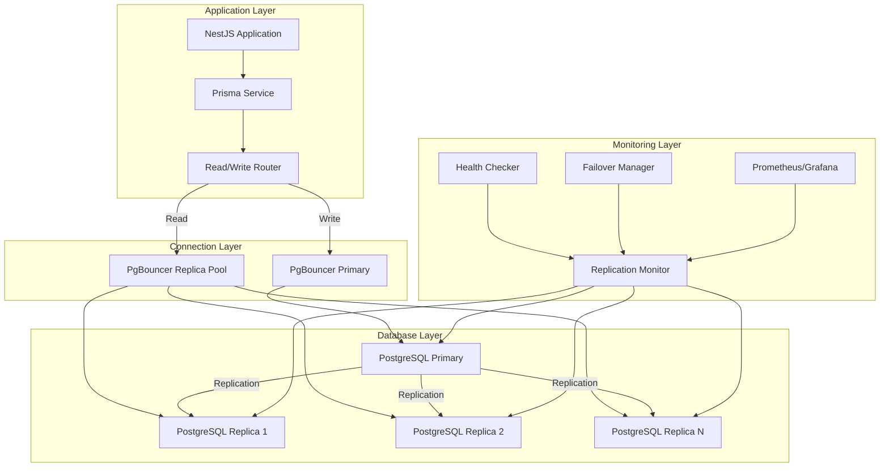

# PostgreSQL Replication System for 4G3N7

## Overview
This comprehensive replication system provides high availability, scalability, and performance for the 4G3N7 PostgreSQL database through a primary-replica architecture with automatic failover capabilities.

## Architecture Components

### 1. Primary-Replica Setup
- **Primary Database**: Handles all write operations and read operations when replicas are unavailable
- **Replica Databases**: Multiple read-only replicas for scaling read operations
- **Automatic Failover**: Promotes replica to primary when primary fails
- **Connection Pooling**: PgBouncer for efficient connection management

### 2. Read/Write Splitting
- **Write Operations**: Routed to primary database
- **Read Operations**: Load balanced across healthy replicas
- **Health Monitoring**: Continuous replica health and lag monitoring
- **Fallback Logic**: Automatic fallback to primary when replicas are unhealthy

### 3. Monitoring & Alerting
- **Replication Lag Monitoring**: Track delay between primary and replicas
- **Health Checks**: Database connectivity and query performance
- **Metrics Collection**: Prometheus metrics for comprehensive monitoring
- **Alert System**: Notifications for replication issues and failover events

## Features

- ✅ Streaming replication with synchronous/async options
- ✅ Automatic failover with replica promotion
- ✅ Read/write splitting with intelligent routing
- ✅ Connection pooling and load balancing
- ✅ Health monitoring and replication lag detection
- ✅ Backup and point-in-time recovery
- ✅ Docker Compose and Kubernetes deployment
- ✅ Comprehensive monitoring and alerting
- ✅ Rolling updates and zero-downtime maintenance

## Directory Structure

```
database-replication/
├── README.md                          # This file
├── architecture/                      # Architecture documentation
├── scripts/                          # Setup and management scripts
├── configs/                          # Configuration files
├── docker/                           # Docker configurations
├── kubernetes/                       # Kubernetes/Helm charts
├── prisma/                          # Prisma service modifications
├── monitoring/                      # Monitoring and alerting setup
└── docs/                           # Detailed documentation
```

## Quick Start

### Development Setup
```bash
# Start the replication system
cd docker
docker-compose -f docker-compose.replication.yml up -d

# Check replication status
./scripts/check-replication-status.sh
```

### Production Setup
```bash
# Deploy to Kubernetes
cd kubernetes
helm install 4g3n7-replication ./4g3n7-replication

# Monitor deployment
kubectl get pods -l app=4g3n7-replication
```

## Architecture Diagram



## Performance Benefits

- **Read Scalability**: Distribute read queries across multiple replicas
- **High Availability**: Automatic failover ensures continuous service
- **Connection Efficiency**: PgBouncer reduces connection overhead
- **Geographic Distribution**: Replicas can be placed closer to users
- **Load Distribution**: Balance query load for optimal performance

## Next Steps

1. Review the [architecture documentation](./architecture/README.md)
2. Set up the [development environment](./docker/README.md)
3. Configure [monitoring and alerting](./monitoring/README.md)
4. Plan your [production deployment](./kubernetes/README.md)